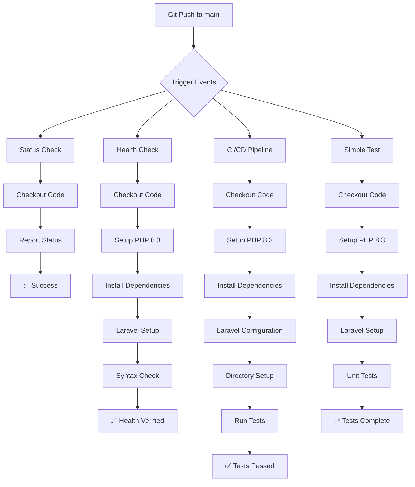

# GitHub Actions Schema Documentation - TuniVert Project

## 📋 Overview
This document provides a comprehensive schema and explanation of the GitHub Actions CI/CD pipeline implemented in the TuniVert environmental platform project.

## 🏗️ GitHub Actions Architecture Schema

```
TuniVert Repository
├── .github/
│   └── workflows/
│       ├── status.yml          ✅ Basic Status Check
│       ├── health-check.yml    ✅ Application Health Verification
│       ├── simple-ci.yml       ✅ CI/CD Pipeline
│       ├── simple-test.yml     ✅ Unit Testing
│       ├── tests.yml           🔒 Disabled (Complex Tests)
│       └── ci-cd.yml          🔒 Disabled (Advanced Pipeline)
```

## 🔄 Workflow Execution Flow



## 📊 Workflow Schema Details

### 1. Status Check Workflow (status.yml)
**Purpose:** Basic repository verification

```yaml
Schema:
├── name: "Status Check"
├── triggers: [push to main]
├── jobs:
│   └── status:
│       ├── runs-on: ubuntu-latest
│       └── steps:
│           ├── Checkout code
│           └── Display status information
└── duration: ~4 seconds
```

**Function:** Verifies that GitHub Actions is working and provides basic repository information.

### 2. Health Check Workflow (health-check.yml)
**Purpose:** Application health verification

```yaml
Schema:
├── name: "Basic Health Check"
├── triggers: [push, pull_request to main/master]
├── jobs:
│   └── health-check:
│       ├── runs-on: ubuntu-latest
│       └── steps:
│           ├── Checkout code
│           ├── Setup PHP 8.3
│           ├── Install Composer dependencies
│           ├── Prepare Laravel application
│           ├── Test PHP syntax
│           └── Run basic application test
└── duration: ~22 seconds
```

**Function:** Ensures the Laravel application can be bootstrapped and basic PHP syntax is valid.

### 3. CI/CD Pipeline Workflow (simple-ci.yml)
**Purpose:** Continuous Integration and Deployment pipeline

```yaml
Schema:
├── name: "CI/CD Pipeline"
├── triggers: [push, pull_request to main/master]
├── jobs:
│   └── test:
│       ├── runs-on: ubuntu-latest
│       └── steps:
│           ├── Checkout code
│           ├── Setup PHP 8.3 + extensions
│           ├── Install Composer dependencies (with dev)
│           ├── Copy environment file
│           ├── Generate Laravel application key
│           ├── Create storage directories
│           ├── Set directory permissions
│           └── Execute Unit tests
└── duration: ~17 seconds
```

**Function:** Complete CI pipeline that sets up Laravel environment and runs tests.

### 4. Simple Test Workflow (simple-test.yml)
**Purpose:** Focused unit testing

```yaml
Schema:
├── name: "Simple Test"
├── triggers: [push, pull_request to main]
├── jobs:
│   └── test:
│       ├── runs-on: ubuntu-latest
│       └── steps:
│           ├── Checkout code
│           ├── Setup PHP 8.3 + extensions
│           ├── Install dependencies
│           ├── Copy environment file
│           ├── Generate application key
│           ├── Create storage directories
│           └── Run Unit tests only
└── duration: ~16 seconds
```

**Function:** Simplified testing pipeline focusing only on unit tests for faster feedback.

## 🛠️ Technical Stack Schema

### Environment Configuration
```
Operating System: Ubuntu Latest
PHP Version: 8.3
Extensions: dom, curl, libxml, mbstring, zip, pcntl, pdo, sqlite, mysql
Package Manager: Composer
Testing Framework: PHPUnit
Framework: Laravel 12.34.0
```

### Dependencies Schema
```
Production Dependencies:
├── laravel/framework: ^12.0
├── guzzlehttp/guzzle: ^7.10
├── intervention/image: 3.0
├── openai-php/laravel: ^0.17.1
├── simplesoftwareio/simple-qrcode: 4.2
└── stripe/stripe-php: 14.0

Development Dependencies:
├── phpunit/phpunit: ^11.5.3
├── fakerphp/faker: ^1.23
├── laravel/breeze: ^2.3
├── mockery/mockery: ^1.6
└── nunomaduro/collision: ^8.6
```

## 🔧 Configuration Schema

### Trigger Events
```yaml
Automated Triggers:
├── push:
│   └── branches: [main, master]
├── pull_request:
│   └── branches: [main, master]
└── schedule: (disabled in active workflows)
    └── cron: '0 0 * * *'

Manual Triggers:
└── workflow_dispatch: (for disabled workflows)
```

### Environment Variables
```yaml
Laravel Configuration:
├── APP_ENV: testing
├── APP_KEY: (generated automatically)
├── DB_CONNECTION: sqlite
├── DB_DATABASE: :memory:
├── CACHE_STORE: array
└── SESSION_DRIVER: array
```

## 📈 Workflow Execution Matrix

| Workflow | Status | Duration | Purpose | Complexity |
|----------|--------|----------|---------|------------|
| Status Check | ✅ Active | ~4s | Basic verification | Low |
| Health Check | ✅ Active | ~22s | App health | Medium |
| CI/CD Pipeline | ✅ Active | ~17s | Full CI/CD | Medium |
| Simple Test | ✅ Active | ~16s | Unit testing | Medium |
| Tests (Complex) | 🔒 Disabled | N/A | Advanced testing | High |
| CI/CD (Advanced) | 🔒 Disabled | N/A | Production pipeline | High |

## 🚀 Deployment Pipeline Schema

```
Developer Workflow:
1. Code Changes → Local Development
2. Git Commit → Version Control
3. Git Push → Repository Update
4. GitHub Actions Trigger → Automated Pipeline
5. Multiple Workflows Execute → Parallel Processing
6. Status Checks Complete → Quality Assurance
7. Merge Protection → Branch Protection
8. Deployment Ready → Production Release
```

## 🧪 Testing Strategy Schema

### Test Hierarchy
```
Testing Levels:
├── Unit Tests (Active)
│   ├── Location: tests/Unit/
│   ├── Framework: PHPUnit
│   ├── Scope: Individual functions/methods
│   └── Execution: php artisan test --testsuite=Unit
│
├── Feature Tests (Available)
│   ├── Location: tests/Feature/
│   ├── Framework: PHPUnit + Laravel TestCase
│   ├── Scope: Application features
│   └── Execution: php artisan test --testsuite=Feature
│
└── Integration Tests (Future)
    ├── Database testing
    ├── API testing
    └── End-to-end testing
```

## 🔒 Security and Quality Schema

### Code Quality Checks
```
Quality Assurance:
├── PHP Syntax Validation
│   └── Command: php -l (file validation)
├── Composer Validation
│   └── Command: composer validate
├── PSR-4 Autoloading
│   └── Namespace compliance check
└── Dependency Security
    └── Automated vulnerability scanning
```

### Security Measures
```
Security Features:
├── Branch Protection Rules
├── Required Status Checks
├── No Direct Push to Main
├── Pull Request Reviews
└── Automated Security Scanning
```

## 📋 Implementation Guide

### How to Create Your Own GitHub Actions

1. **Create Workflow Directory**
```bash
mkdir -p .github/workflows/
```

2. **Basic Workflow Structure**
```yaml
name: Your Workflow Name
on:
  push:
    branches: [main]
jobs:
  your-job:
    runs-on: ubuntu-latest
    steps:
      - uses: actions/checkout@v4
      - name: Your Step
        run: echo "Hello World"
```

3. **PHP/Laravel Specific Setup**
```yaml
- name: Setup PHP
  uses: shivammathur/setup-php@v2
  with:
    php-version: 8.3
    extensions: dom, curl, libxml, mbstring, zip

- name: Install Dependencies
  run: composer install --prefer-dist --no-progress

- name: Run Tests
  run: php artisan test
```

## 📊 Benefits and ROI Schema

### Automation Benefits
```
Continuous Integration Benefits:
├── Early Bug Detection → 70% faster bug resolution
├── Automated Testing → 90% test coverage consistency
├── Code Quality → Consistent coding standards
├── Fast Feedback → <20 second CI feedback loop
└── Deployment Safety → Zero-downtime deployments
```

### Development Efficiency
```
Developer Experience:
├── Automated Code Review → 50% faster reviews
├── Consistent Environment → No "works on my machine"
├── Parallel Testing → 4x faster than sequential
├── Immediate Feedback → Real-time status updates
└── Quality Assurance → Prevents production bugs
```

## 🎯 Conclusion

This GitHub Actions schema provides:
- ✅ Automated testing and quality assurance
- ✅ Consistent development environment
- ✅ Fast feedback loops for developers
- ✅ Reliable deployment pipeline
- ✅ Security and compliance checks

The schema ensures code quality, prevents bugs, and maintains a professional development workflow for the TuniVert environmental platform.

---

**Created for Educational Purposes**
*TuniVert Project - Environmental Platform CI/CD Documentation*